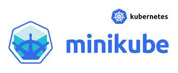
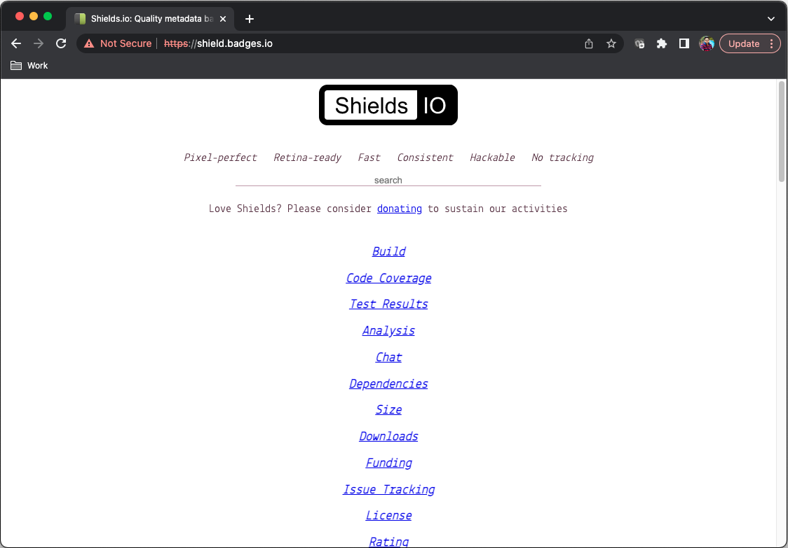

<!-- Improved compatibility of back to top link: See: https://github.com/othneildrew/Best-README-Template/pull/73 -->
<a name="readme-top"></a>

<!-- PROJECT LOGO -->
<br />
<div align="center">
  <a href="https://github.com/github_username/repo_name">
    
  </a>

<h3 align="center">Web App in Kubernetes</h3>

  <p align="center">
    Deploying a web app in minikube including self signed certificate
    <br />
    <a href="https://github.com/github_username/repo_name"><strong>Explore the docs »</strong></a>
    <br />
    <br />
    <a href="https://github.com/github_username/repo_name">View Demo</a>
    ·
    <a href="https://github.com/github_username/repo_name/issues">Report Bug</a>
    ·
    <a href="https://github.com/github_username/repo_name/issues">Request Feature</a>
  </p>
</div>


<!-- TABLE OF CONTENTS -->
<details>
  <summary>Table of Contents</summary>
  <ol>
    <li>
      <a href="#about-the-project">About The Project</a>
      <ul>
        <li><a href="#built-with">Built With</a></li>
      </ul>
    </li>
    <li>
      <a></a>
      <ul>
        <li><a href="#prerequisites">Prerequisites</a></li>
        <li><a href="#installation">Installation</a></li>
      </ul>
    </li>
    <li><a href="#usage">Usage</a></li>
    <li><a href="#roadmap">Roadmap</a></li>
    <li><a href="#contributing">Contributing</a></li>
    <li><a href="#license">License</a></li>
    <li><a href="#contact">Contact</a></li>
    <li><a href="#acknowledgments">Acknowledgments</a></li>
  </ol>
</details>


<!-- ABOUT THE PROJECT -->
## About The Project

This is a small project, where I host a web-app - [shields.io](https://shields.io/) in a pod using minikube in a secure way using self signed certificate.


<p align="right">(<a href="#readme-top">back to top</a>)</p>


### Built With

 [![Kubernetes][Kubernetes]][Kubernetes]


<p align="right">(<a href="#readme-top">back to top</a>)</p>


### Prerequisites

Install Minikube
* [Minikube](https://minikube.sigs.k8s.io/docs/start/)

### Setup 

1. Clone the repo
   ```sh
   git clone https://github.com/github_username/repo_name.git
   ```
2. Create the deployment of the webapp
    ```sh
    kubectl create -f shields-deployment.yaml
    ```
3. Create the service which will bind the app to a service
   ```sh
   kubectl create -f service.yaml
   ```
4. Check logs if pod is up and running 
   ```sh
   kubectl logs <pod-name>
   ```
5. Now to use a self-signed certificate and to make application accessible via DNS, follow the below steps
    ```sh
    # Generate the CA key
    OpenSSL genrsa -out ca.key 2048
    # Generate the certificate and attach it to the CN
    openssl req -x509 \
        -new -nodes  \
        -days 365  \
        -key ca.key  \
        -out ca.crt  \
        -subj "/CN=shield.badges.io"
    ```
6. Deploy the loadbalancer configuration which also contains the secret creation. This secret consists the certificate `key` and `.cert`
    ```sh
    kubectl apply -f Ingress.yaml
    ```
7. Since it is a sel-signed certificate add edit and add the following to your `/etc/hosts` file to make the DNS recognizable
    ```sh
    # Get the minkube (Kubernetes) IP
    # Example in my case it is 192.168.64.2
    echo '192.168.64.2 shield.badges.io' >> /etc/hosts
    ```
8. Visit the DNS/URL in browser and there you go. You have yoour app running as follows



<p align="right">(<a href="#readme-top">back to top</a>)</p>


<!-- MARKDOWN LINKS & IMAGES -->
<!-- https://www.markdownguide.org/basic-syntax/#reference-style-links -->
[contributors-shield]: https://img.shields.io/github/contributors/github_username/repo_name.svg?style=for-the-badge
[contributors-url]: https://github.com/github_username/repo_name/graphs/contributors
[forks-shield]: https://img.shields.io/github/forks/github_username/repo_name.svg?style=for-the-badge
[forks-url]: https://github.com/github_username/repo_name/network/members
[stars-shield]: https://img.shields.io/github/stars/github_username/repo_name.svg?style=for-the-badge
[stars-url]: https://github.com/github_username/repo_name/stargazers
[issues-shield]: https://img.shields.io/github/issues/github_username/repo_name.svg?style=for-the-badge
[issues-url]: https://github.com/github_username/repo_name/issues
[license-shield]: https://img.shields.io/github/license/github_username/repo_name.svg?style=for-the-badge
[license-url]: https://github.com/github_username/repo_name/blob/master/LICENSE.txt
[linkedin-shield]: https://img.shields.io/badge/-LinkedIn-black.svg?style=for-the-badge&logo=linkedin&colorB=555
[linkedin-url]: https://linkedin.com/in/linkedin_username
[product-screenshot]: images/screenshot.png
[Kubernetes]: https://img.shields.io/badge/kubernetes-%23326ce5.svg?style=for-the-badge&logo=kubernetes&logoColor=white
[Next-url]: https://nextjs.org/
[React.js]: https://img.shields.io/badge/React-20232A?style=for-the-badge&logo=react&logoColor=61DAFB
[React-url]: https://reactjs.org/
[Vue.js]: https://img.shields.io/badge/Vue.js-35495E?style=for-the-badge&logo=vuedotjs&logoColor=4FC08D
[Vue-url]: https://vuejs.org/
[Angular.io]: https://img.shields.io/badge/Angular-DD0031?style=for-the-badge&logo=angular&logoColor=white
[Angular-url]: https://angular.io/
[Svelte.dev]: https://img.shields.io/badge/Svelte-4A4A55?style=for-the-badge&logo=svelte&logoColor=FF3E00
[Svelte-url]: https://svelte.dev/
[Laravel.com]: https://img.shields.io/badge/Laravel-FF2D20?style=for-the-badge&logo=laravel&logoColor=white
[Laravel-url]: https://laravel.com
[Bootstrap.com]: https://img.shields.io/badge/Bootstrap-563D7C?style=for-the-badge&logo=bootstrap&logoColor=white
[Bootstrap-url]: https://getbootstrap.com
[JQuery.com]: https://img.shields.io/badge/jQuery-0769AD?style=for-the-badge&logo=jquery&logoColor=white
[JQuery-url]: https://jquery.com 